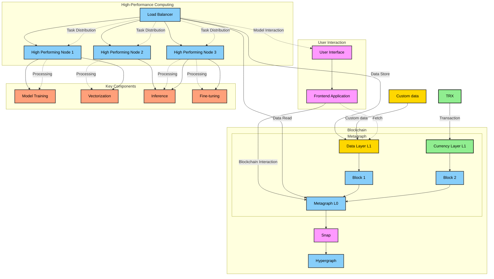

# Metagraph_NFT_Chain


## Welcome to Euclid Development Environment

basically the flow I want to have for
* MINT NFT 
* frontend calls blockchain -- create NFT (pdf data, NFT image,model name,Name of NFT) -- verify using key /Post request 
* blockchain calls backend(ngrok url) and sends data like pdf and model name 
* backend sends RAG back to the blockchain 
* chain stores NFT NAME, RAG, Image, PDF" in NFT created

Start Chat 
* frontend class --- blockchain -- start_chat(NFT ID) 
* blockchain sends pdf and rag to backend backend send a key to blockchain
* blockchain send the key to frontend

Are these flow getting implemented correctly 
what all changes are required

also check build.sbt for errors and tell me about the files that need to be rewritten and changed completely and what exactly to write there


> In WSL dont make this folder on mounted drive


## Setup

### Clone Euclid repository

```bash
git clone https://github.com/Constellation-Labs/euclid-development-environment
cd euclid-development-environment
```

### Create Github token

1. Go to [Github Personal Access Tokens]
2. Click on `Generate new token`
3. Select `repo` and `read:packages` scopes
4. Click on `Generate token`
5. Copy the token

paste in `euclid-development-environment\euclid.json`

### run and deploy

cd to the cloned directory and run the following commands


1. Hydra scipts
```bash
scripts/hydra -h
```

2. install template

```
scripts/hydra install-template
```

```
scripts/hydra install-template nft in this case
```


This will create a new directory in Source which your project name and also detach .git so that you can push it to your own repository

3. Modify the `euclid.json` file with your own values

4. Build the applications
```
scripts/hydra build
```

This will build the applications and create a docker image for the backend 
It also contains the smart contract code that is in the source directory

5. Deploy the applications
```
scripts/hydra start-genesis
```


get private key

pkcs12 -provider legacy -provider default -in token-key.p12 -nocerts -nodes -out privatekey.key


# for privare key use Eth keys


- harsh chats have code ...

- 




Create Account using Stargazer Wallet and copy the private key to setup balance in genesis

euclid-development-environment/source/metagraph-l0/genesis/genesis.csv
