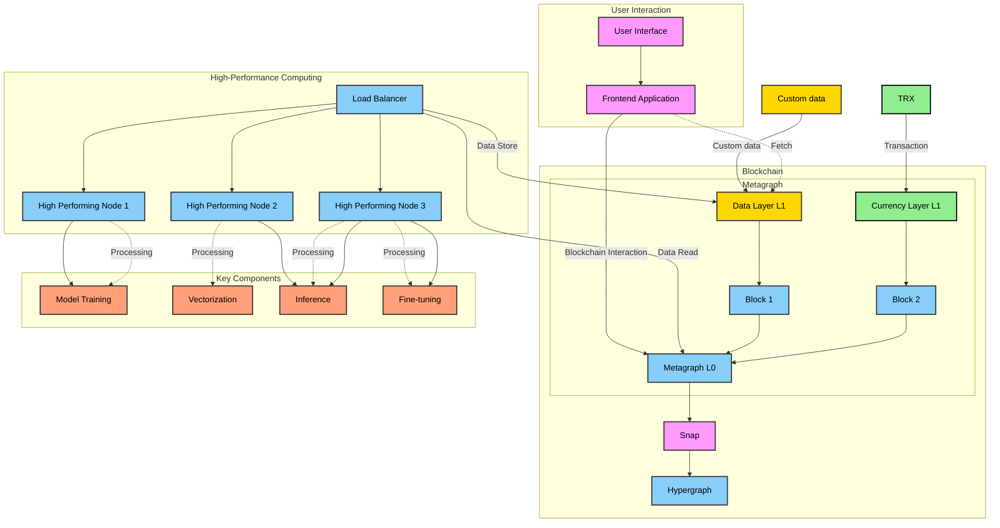

# NeuraNFT: Tokenizing Intelligence on Metagraph_NFT_Chain

## Table of Contents

1. [Introduction](#introduction)
2. [Architecture Overview](#architecture-overview)
3. [Key Components](#key-components)
4. [Technical Architecture](#technical-architecture)
5. [Use Cases](#use-cases)
6. [Benefits](#benefits)
7. [Current Prototype](#current-prototype)
8. [Future Roadmap](#future-roadmap)
9. [Setup and Installation](#setup-and-installation)
10. [Usage](#usage)
11. [Contributing](#contributing)
12. [License](#license)

## Introduction

NeuraNFT is an innovative decentralized AI system built on Constellation Network's Metagraph architecture. It addresses the growing demand for personalized, secure, and decentralized artificial intelligence by combining blockchain technology with a decentralized infrastructure for secure deployment of machine learning models.

NeuraNFT leverages Non-Fungible Tokens (NFTs) to encapsulate fine-tuning data and model information, creating a unique ecosystem enabling users to own, customize, and securely access their AI models. This approach allows for unprecedented personalization and ownership of AI models, while maintaining privacy and security. The system harnesses Constellation's Metagraph architecture and Directed Acyclic Graph (DAG) based consensus for model training and inference, providing a scalable and efficient platform for AI operations.

## Architecture Overview



This diagram illustrates the complex interplay between various components of the NeuraNFT system. It shows how user interactions flow through the frontend application to the blockchain layers, and how the high-performance computing nodes handle various AI tasks such as model training, vectorization, inference, and fine-tuning.

## Key Components

1. Constellation Network and Metagraph Architecture
   - DAG-based Consensus: Enables fast and scalable transactions, crucial for real-time AI model updates and interactions.
   - Metagraph Architecture: Allows for customized blockchain logic and state management, enabling the creation of specialized sub-networks for different aspects of the NeuraNFT ecosystem.
   - Global L0: Facilitates interoperability between different Metagraphs, allowing seamless interaction between various components of the NeuraNFT system.
   - HTTPS Outcalls: Enables seamless integration with external services, crucial for connecting with off-chain AI computation resources and data sources.
   - Custom Token Creation: Supports the creation of L0 tokens, allowing for the implementation of a token economy specific to the NeuraNFT ecosystem.

2. NFT-based AI Models
   - Unique Identity: Each NFT represents a unique AI model, storing model parameters and data embeddings used for training or fine-tuning.
   - Ownership and Control: NFTs provide a clear mechanism for ownership, allowing users to truly own their personalized AI models.
   - Transferability: Users can transfer or sell their AI models, creating potential for a marketplace of specialized AI models.
   - Versioning and Upgradeability: The NFT structure allows for easy tracking of model evolution over time.
   - Privacy: By storing only embeddings and model parameters, rather than raw data, user privacy is enhanced while maintaining model functionality.

3. High-Performance Computing (HPC) Infrastructure
   - Current Prototype: Uses a single HPC node for model training, fine-tuning, and inference.
   - Future Distributed Network: Plans to transition to a network of distributed HPC nodes for increased computational power and redundancy.
   - Blockchain-based Compute System: The ultimate goal is a fully decentralized, blockchain-based compute system for AI model execution.
   - Scalability: Designed to handle increasing computational demands as the user base grows.

4. Custom Metagraph Logic
   - AI Model Management: Handles creation, updating, and deletion of AI model NFTs, including versioning and access control.
   - Access Control: Manages user authentication and authorization for model access.
   - Token Operations: Handles minting, transfer, and burning of NFTs representing AI models.
   - Data Processing: Implements logic for data preprocessing, model training, and inference.
   - API Integration: Provides interfaces for frontend applications to interact with AI models.

## Technical Architecture

NeuraNFT's technical architecture consists of several interconnected Metagraphs:

1. Core Metagraph
   - NFT Management: Handles the lifecycle of AI model NFTs, including minting, transferring, and burning.
   - Ownership Registry: Maintains records of AI model ownership and associated rights.
   - Metadata Storage: Manages metadata associated with AI model NFTs, including versioning.
   - Access Control: Ensures authorized model interactions through role-based access control.

2. AI Compute Metagraph
   - Model Training: Coordinates the training and fine-tuning of AI models using provided data.
   - Inference Requests: Manages requests for model inference and returns results.
   - Compute Resource Allocation: Coordinates the allocation of computational resources.
   - Validation Logic: Implements custom validation to ensure proper model execution and result integrity.

3. User Data Metagraph
   - Personal Data Storage: Securely stores user-specific data used for personalizing AI models.
   - Access Control: Implements strict access controls to ensure user data privacy.
   - Data Preprocessing: Handles the preprocessing and anonymization of user data before use in model training.
   - Consent Management: Manages user consents for data usage in various contexts.

These Metagraphs interact through Constellation's Global L0 layer, enabling a modular and scalable architecture that can evolve with the needs of the NeuraNFT ecosystem.

## Use Cases

1. Personalized AI Assistants: Users can create AI models tailored to their specific needs, interests, and communication styles.
2. Secure Enterprise AI: Companies can develop proprietary AI models that remain fully under their control, addressing key concerns in enterprise AI adoption.
3. AI Model Marketplace: Enables buying, selling, or renting of specialized AI models as NFTs.
4. Decentralized Research Collaboration: Facilitates collaborative AI research with enhanced transparency and credit attribution.
5. Privacy-Preserving Personal Analytics: Allows users to leverage their personal data for insights without compromising privacy.
6. Customized Education and Training: Enables the creation of personalized educational experiences and adaptive learning systems.
7. Decentralized Autonomous Organizations (DAOs): Enhances DAO capabilities through AI integration for complex decision-making processes.

## Benefits

1. Enhanced Data Privacy and Security: User data and AI models are stored securely on the blockchain, with access controlled by cryptographic keys.
2. True Ownership of AI Models: AI models are represented as unique NFTs, providing verifiable ownership on the blockchain.
3. Transparency and Auditability: All transactions and model updates are recorded on the blockchain, creating an unalterable audit trail.
4. Decentralized Infrastructure: Leverages Metagraph's distributed network, enhancing system reliability and resistance to single points of failure.
5. Interoperability and Composability: Standardized NFTs for AI models enable easy integration with other blockchain-based systems.
6. Democratization of AI: Lowers barriers to entry in AI development, allowing individuals and small organizations to create and deploy sophisticated AI models.
7. Fair Compensation for Model Creation: Establishes a clear path to monetization for AI developers through the NFT marketplace.
8. Reduced Centralized Control: Prevents monopolistic practices in the AI ecosystem, ensuring a diverse and competitive environment.
9. Continuous Improvement and Versioning: Provides a robust framework for AI model evolution, with clear version histories.
10. Regulatory Compliance: Facilitates adherence to legal and ethical standards through clear ownership and data control mechanisms.

## Current Prototype

The current prototype demonstrates core functionality using a single HPC node implementation. It serves as a proof of concept and foundation for future development.

### Mint NFT Flow
1. Frontend calls blockchain to create NFT (pdf data, NFT image, model name, Name of NFT)
2. Blockchain verifies using key/Post request
3. Blockchain calls backend (ngrok url) and sends data like pdf and model name
4. Backend sends RAG (Retrieval-Augmented Generation) back to the blockchain
5. Chain stores NFT NAME, RAG, Image, PDF in the created NFT

This flow demonstrates how a new AI model NFT is created, incorporating both on-chain and off-chain components to ensure data integrity and efficient processing.

### Start Chat Flow
1. Frontend calls blockchain - start_chat(NFT ID)
2. Blockchain sends pdf and rag to backend
3. Backend sends a key to blockchain
4. Blockchain sends the key to frontend

This flow illustrates how users can interact with their AI model NFTs, ensuring secure access and efficient data retrieval for real-time interactions.

## Future Roadmap

1. Distributed HPC Network: Transition to a network of globally distributed nodes for improved performance and reliability.
2. Blockchain-Based Compute System: Move more computational tasks onto the blockchain for enhanced decentralization.
3. Advanced NFT Functionality: Enable combining multiple AI model NFTs and implement fractional ownership.
4. AI Model Marketplace: Develop a decentralized platform for trading AI model NFTs.
5. Governance and DAO Integration: Implement a robust decentralized governance structure for key decision-making processes.
6. Interoperability and Standards: Develop bridges to other blockchain networks and establish standards for decentralized AI model representation.
7. Privacy and Security Enhancements: Implement advanced techniques like homomorphic encryption and differential privacy.
8. Ethical AI and Compliance Framework: Develop on-chain tools for auditing AI models for bias, fairness, and ethical considerations.
9. Advanced AI Capabilities: Expand to handle various data types and explore AI-to-AI interaction frameworks.
10. Real-World Integration: Develop protocols for integrating with IoT devices and create tailored solutions for enterprise-grade deployment.

## Setup and Installation

### Prerequisites
- Git
- GitHub account with personal access token

### Clone Euclid repository

```bash
git clone https://github.com/Constellation-Labs/euclid-development-environment
cd euclid-development-environment
```

### Create Github token

1. Go to [Github Personal Access Tokens](https://github.com/settings/tokens)
2. Click on `Generate new token`
3. Select `repo` and `read:packages` scopes
4. Click on `Generate token`
5. Copy the token

Paste the token in `euclid-development-environment\euclid.json`

### Installation Steps

1. View Hydra scripts help:
```bash
scripts/hydra -h
```

2. Install template:
```bash
scripts/hydra install-template nft
```

This will create a new directory in Source with your project name and also detach .git so that you can push it to your own repository.

3. Modify the `euclid.json` file with your own values

4. Build the applications:
```bash
scripts/hydra build
```

This will build the applications and create a docker image for the backend. It also contains the smart contract code that is in the source directory.

5. Deploy the applications:
```bash
scripts/hydra start-genesis
```

### Additional Notes

- To get the private key:
```
pkcs12 -provider legacy -provider default -in token-key.p12 -nocerts -nodes -out privatekey.key
```

- For private keys, use Eth keys

- In WSL, don't make this folder on a mounted drive

## Usage

(Here, you would include instructions on how to use the application, including any CLI commands, API endpoints, or user interface instructions.)

## Contributing

We welcome contributions to the NeuraNFT project! Please read our contributing guidelines before submitting pull requests.

## License

(Include information about the project's license here.)

---

For more detailed information about the project, please refer to our [whitepaper](link-to-whitepaper).

For questions or support, please [open an issue](link-to-issues) or contact us at [contact email].
